# SocialHealth Admin Desktop Application

## Giới thiệu

SocialHealth Admin Desktop Application là một ứng dụng quản lý cho nền tảng SocialHealth, được phát triển bằng SwiftUI. Ứng dụng này cung cấp các công cụ cần thiết để quản lý người dùng, thức ăn, bài tập và bài viết trên nền tảng SocialHealth.
| AppName                  | Link                                                      |
|--------------------------|-----------------------------------------------------------|
| <span style="color:red">App desktop social health</span> | <span style="color:red">https://github.com/henrytran1803/AppDesktopSocialHealth</span> |
| <span style="color:blue">App social health</span> | <span style="color:blue">https://github.com/henrytran1803/AppSocialHealth</span> |
| <span style="color:blue">Back end socialhealth</span> | <span style="color:blue">https://github.com/henrytran1803/BESocialHealth</span> |

## Tính năng

### 1. Quản lý Người dùng
- Thêm mới người dùng.
- Chỉnh sửa thông tin người dùng.
- Xóa người dùng.
- Xem danh sách người dùng.

### 2. Quản lý Thức ăn
- Thêm mới thức ăn.
- Chỉnh sửa thông tin thức ăn.
- Xóa thức ăn.
- Xem danh sách thức ăn.

### 3. Quản lý Bài tập
- Thêm mới bài tập.
- Chỉnh sửa thông tin bài tập.
- Xóa bài tập.
- Xem danh sách bài tập.

### 4. Quản lý Bài viết
- Thêm mới bài viết.
- Chỉnh sửa bài viết.
- Xóa bài viết.
- Xem danh sách bài viết.
- Tương tác với bài viết (like, comment).

## End point API
- tất cả đều được lưu trữ trong thư mục comon

## Cài đặt

### Yêu cầu Hệ thống
- macOS 14.0 trở lên.
- Xcode 15.0 trở lên.
- Swift 5.3 trở lên.

### Hướng dẫn Cài đặt
1. Clone repository từ GitHub:
   ```bash
   git clone https://github.com/henrytran1803/AppDesktopSocialHealth
   cd AppDesktopSocialHealth
   ```

2. Mở dự án với Xcode:
   ```bash
   open SocialHealthAdmin.xcodeproj
   ```

3. Thiết lập các thông tin cấu hình cần thiết (nếu có):
   - Các API endpoints cho backend
   

4. Build và chạy ứng dụng:
   - Chọn target `SocialHealthAdmin` và nhấn `Cmd + R`.

## Cấu trúc Thư mục

- `AppDesktopSocialHealth/`: Chứa mã nguồn chính của ứng dụng.
- `AppDesktopSocialHealth/Resources/`: Chứa các tài nguyên như hình ảnh, tệp JSON, v.v.

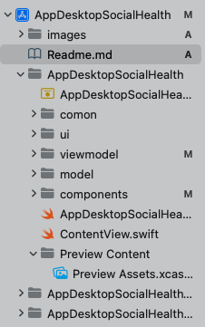


## Sử dụng

### Đăng nhập
- Sử dụng tài khoản admin để đăng nhập vào hệ thống.

### Quản lý Người dùng
- Truy cập vào tab "Người dùng" để thực hiện các thao tác quản lý.

### Quản lý Thức ăn
- Truy cập vào tab "Thức ăn" để thực hiện các thao tác quản lý.

### Quản lý Bài tập
- Truy cập vào tab "Bài tập" để thực hiện các thao tác quản lý.

### Quản lý Bài viết
- Truy cập vào tab "Bài viết" để thực hiện các thao tác quản lý và tương tác.

## Hình ảnh sản phẩm
### Giao diện Đăng nhập
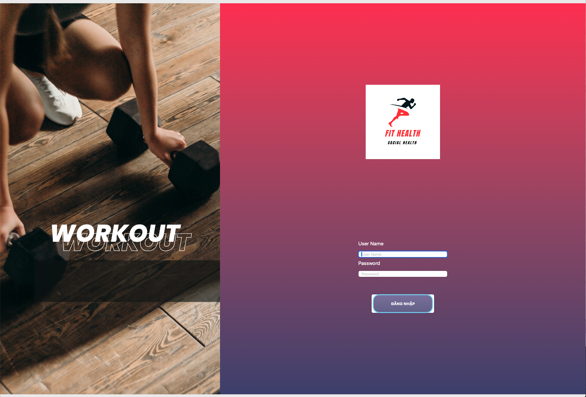
### Giao diện Dashboard
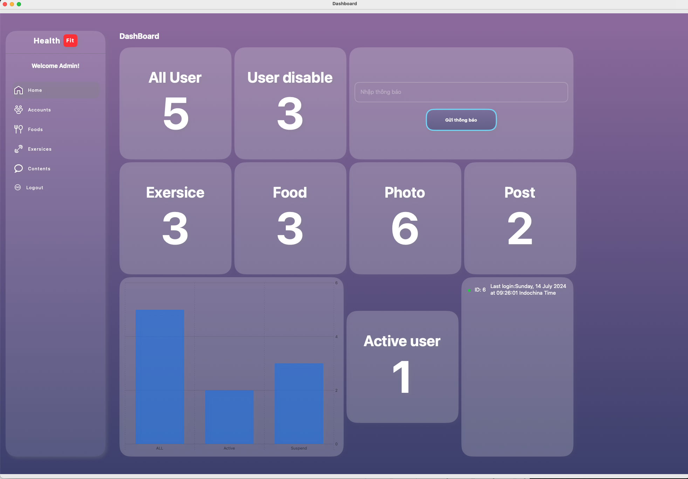
### Giao diện Quản lý người dùng
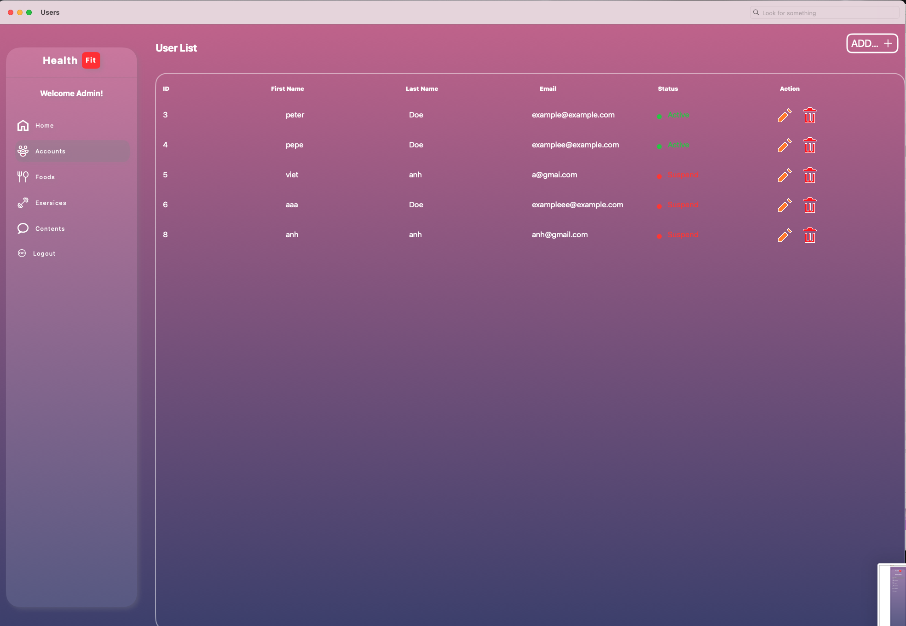
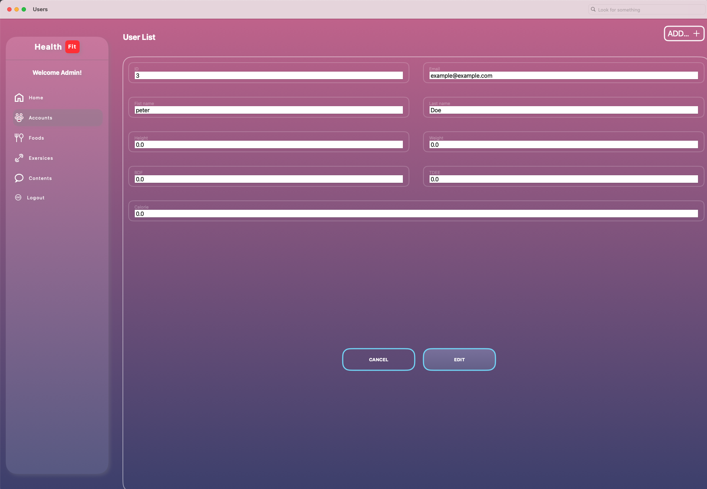
### Giao diện Quản lý món ăn
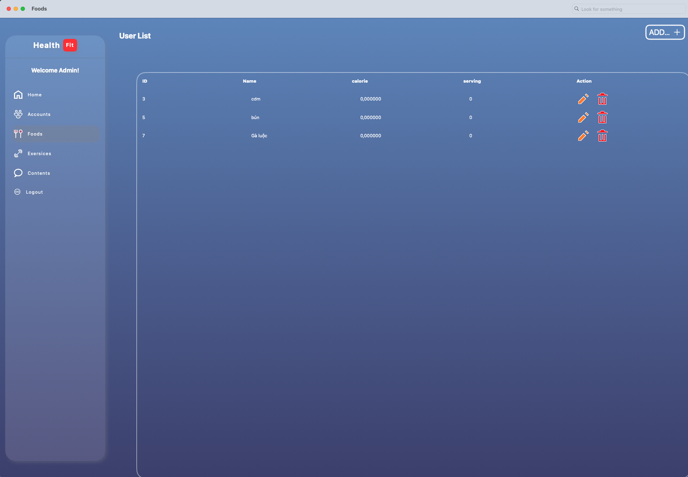
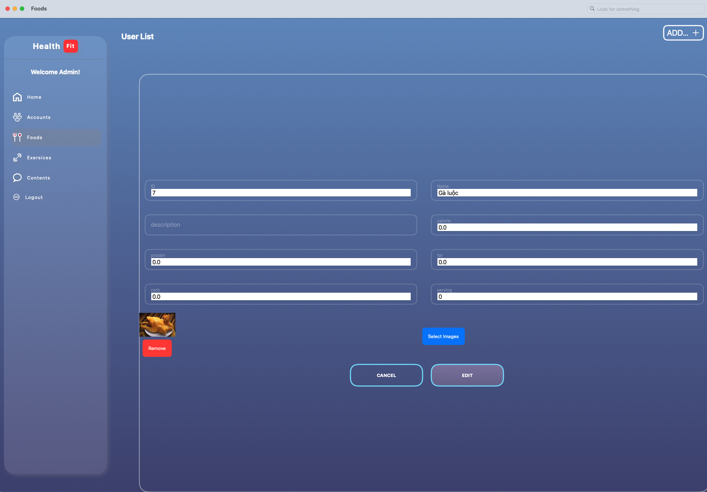
### Giao diện Quản lý bài tập
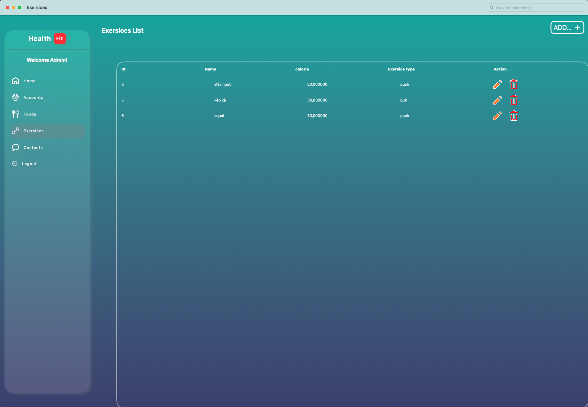
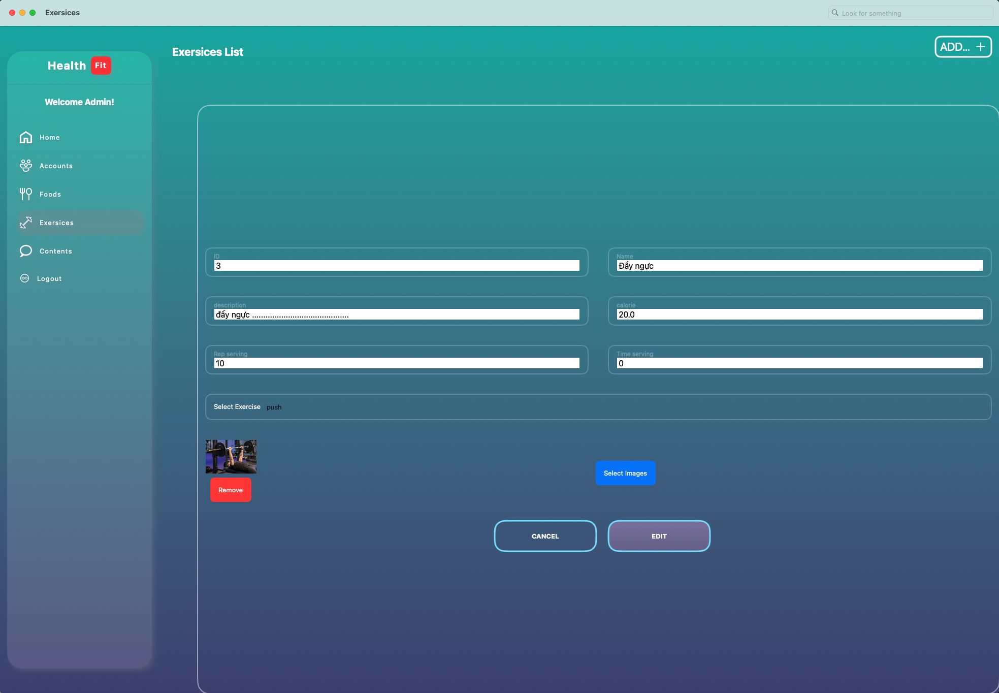
### Giao diện Quản lý bài đăng
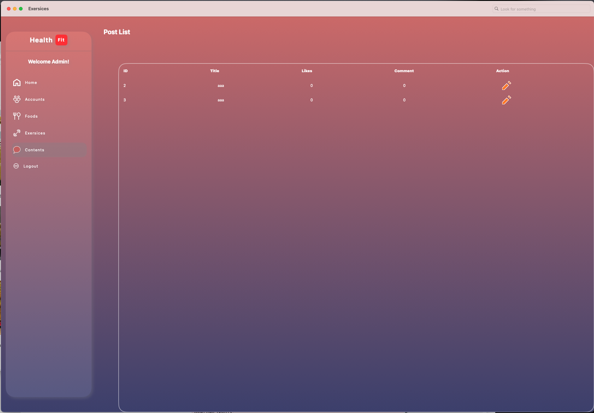
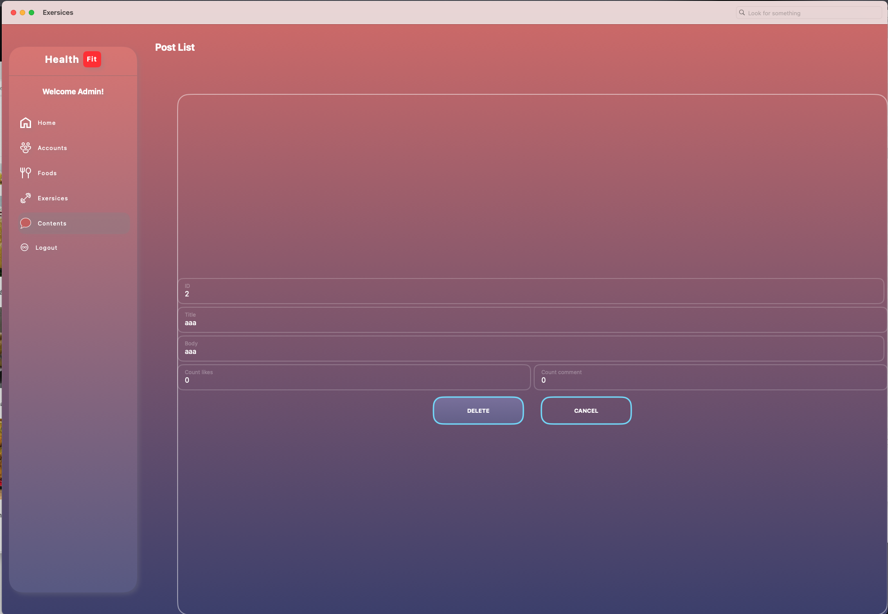
